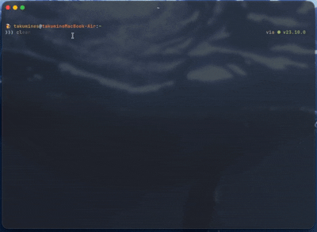

# cluade

A joke CLI tool for anyone who typed `cluade` instead of `claude`.

Displays a startup screen mimicking [Claude Code](https://github.com/anthropics/claude-code), then the logo crumbles apart to point out your typo.

## Demo



## Install

```sh
go install github.com/takumines/cluade@latest
```

## Usage

```sh
cluade
```
